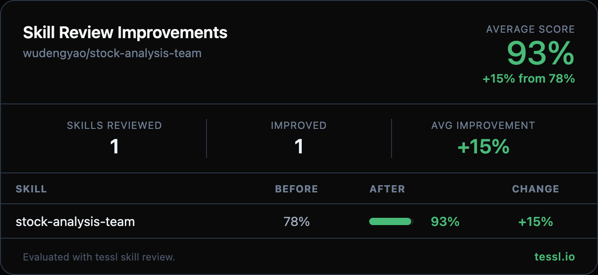

Hey @wudengyao 👋

I ran your skills through `tessl skill review` at work and found some targeted improvements. Here's the full before/after:

| Skill | Before | After | Change |
|-------|--------|-------|--------|
| stock-analysis-team | 78% | 93% | +15% |

Changes made

- **Description specificity**: Expanded the frontmatter description to list concrete actions (PE/PB/ROE valuation, K-line/MACD/RSI chart generation, sentiment evaluation, strategy formulation, backtesting) — moved from category-level to action-level detail
- **Structured output formats**: Added explicit output schemas for analyst, researcher, and trader team steps (e.g. `{score, outlook, reasoning, confidence}`) to make the multi-role workflow more actionable
- **Validation checkpoints**: Added error recovery steps after data fetching (check for valid data, handle invalid stock codes) and chart generation (verify files exist, graceful fallback)
- **Conciseness**: Replaced the verbose HTML report section breakdown (9 bullet points) with a reference to the existing `report-template.md`, cutting redundancy while preserving all detail
- **Frontmatter format**: Wrapped description in quoted string per standard format

Honest disclosure — I work at @tesslio where we build tooling around skills like these. Not a pitch - just saw room for improvement and wanted to contribute.

Want to self-improve your skills? Just point your agent (Claude Code, Codex, etc.) at [this Tessl guide](https://docs.tessl.io/evaluate/optimize-a-skill-using-best-practices) and ask it to optimize your skill. Ping me - [@yogesh-tessl](https://github.com/yogesh-tessl) - if you hit any snags.

Thanks in advance 🙏
